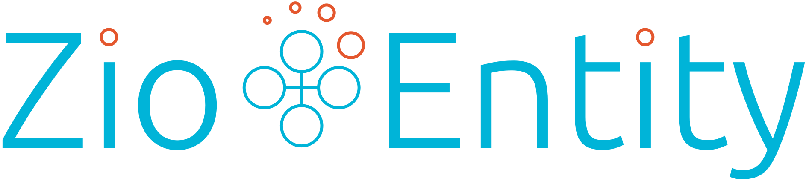

[![Project stage][Stage]][Stage-Page] [](https://github.com/thehonesttech/zio-entity/actions/workflows/scala.yml) [](https://scala-steward.org) [](https://jitpack.io/private#thehonesttech/zio-entity)

# ZIO-Entity
Event sourcing refers to a collection of patterns based on persisting the full history of a domain as a sequence of
immutable “events”, rather than persisting just the current state.

CQRS (Command-Query-Responsible-Segregation) is a simple pattern that strictly segregates the responsibility of handling command input into an autonomous system from the responsibility of handling side-effect-free query/read access on the same system.

ZIO-Entities are distributed business domain objects, with a unique identifier, whose state is changed using event-sourcing and automatically persisted into a DB in a functional way.

They apply the CQRS pattern through read-side views.
An Entity with a specific id is a Singleton in the cluster, and this means that you will never have to deal with concurrency within nodes as ZIO-Entities implement the "Single Writer Principle" .

## Inspiration

This project is inspired by **Lagom** and **Aecor**.

## Rationale

Historically all event sourcing frameworks have failed. The reason, in my opinion is the high barrier to entry. The
concept of event sourcing is simple enough but, applying the concepts requires a deep understanding of the underlying
infrastructure.

Other frameworks have issues with testing, they use future, tests are non-deterministic, and they could be flaky.
Stubbing the underlying stores is difficult and sub-optimal.

These frameworks are pretty opinionated and very soon you can hit limitations. Other libraries are instead too difficult
to use or not maintained anymore.

ZIO-Entity wants to be a simple-to-use library that brings distributed event sourcing in the ZIO world.

## Features

- ZIO
- Easy and versatile API
- RPC style Entities
- ZIO Stream CQRS
- Distributed by nature with pluggable runtimes
- Pluggable stores
- Schema evolution
- Testable in milliseconds

### ZIO

ZIO-Entity is integrated in the ZIO ecosystem with all the advantages that the effect library can provide. As a result,
tests can run in ms, they are deterministic, fast and easy to reason.

### Easy and versatile API

Calling an Entity is as easy as writing

```scala
accounts(fooAccount).credit(10 EUR)
```

### RPC style Entities

DDD Entities, use some magic (aka macro) in order to allow RPC style invocation. Amount of boilerplate code is
drastically reduced and an entity can be invoked as a normal class. Testing a Zio-Entity is a lot easier since it can be
tested like normal code.

The library will distribute the request in the cluster and serialize commands using either Scodec or Protobuf.

The optional annotation `@Id` can be used to maintain schema compatibility if method is renamed. The id used will
be the unique number set in the annotation.

### ZIO Stream CQRS

Process ReadSide (CQRS) using ZIO Stream.

### Distributed by nature with pluggable runtimes

All the calls against a ZIO-entity are distributed. The distribution mechanism is called Runtime. At the moment Akka-Cluster, Local, LocalWithProtocol and Test are ready.
New runtimes using Zookeeper and Native implementations are in the works and new ones can be easily
added.

### Pluggable stores

The log and snapshot stores can be configured with implementations available like Memory and Postgres with Cassandra in
the works.

### Schema evolution ready

Plug in protobuf, avro, json in order to manage database and communication evolution.

### Testable in milliseconds

Being part of ZIO ecosystem and using ZIO Stream, tests can be easy, quick and deterministic, no more eventually, no
more flakyness. Test tools are available in order to test async interaction in a Reactive way.

### Example

Interacting with entities is very simple, and they behave like normal ZIO effects:

```scala
for {
  counter <- entity[String, Counter, Int, CountEvent, String]
  res <- counter("key").increase(3)
  state <- counter("key").getValue
} yield state

```

Or subscribing to projections (here a simple projection that counts events):

```scala
for {
  counter <- entity[String, Counter, Int, CountEvent, String]
  state <- Ref.make(0)
  killSwitch <- counter
    .readSideSubscription(ReadSideParams("read", ConsumerId("1"), CounterEntity.tagging, 2, ReadSide.countIncreaseEvents(state, _, _)), _.getMessage)
} yield killSwitch
```

Below an example of the counter entity:

```scala
sealed trait CountEvent

case class CountIncremented(number: Int) extends CountEvent

case class CountDecremented(number: Int) extends CountEvent

trait Counter {
  @Id(1)
  def increase(number: Int): IO[String, Int]

  @Id(2)
  def decrease(number: Int): IO[String, Int]

  @Id(3)
  def getValue: IO[String, Int]
}

class CounterCommandHandler(combinators: Combinators[Int, CountEvent, String]) extends Counter {
  import combinators._
  def increase(number: Int): IO[String, Int] =
    read flatMap { res =>
      append(CountIncremented(number)).as(res + number)
    }

  def decrease(number: Int): IO[String, Int] =
    read flatMap { res =>
      append(CountDecremented(number)).as(res - number)
    }

  def getValue: IO[String, Int] = read
}

```

Define your event foldable logic:

```scala

val eventHandlerLogic: Fold[Int, CountEvent] = Fold(
  initial = 0,
  reduce = {
    case (state, CountIncremented(number)) => UIO.succeed(state + number)
    case (state, CountDecremented(number)) => UIO.succeed(state - number)
    case _ => impossible
  }
)
```

Define the rpc protocol with the Command handler, the state, the event and the error types:

```scala
  implicit val counterProtocol: EntityProtocol[Counter, String] =
  RpcMacro.derive[Counter, String]

```

Choose the Runtime and build layer

```scala
  private val stores: ZLayer[Any, Nothing, Has[Stores[String, CountEvent, Int]]] = Clock.live to MemoryStores.live[String, CountEvent, Int](100.millis, 2)
  
  private val layer: ZLayer[ZEnv, Throwable, Has[Entity[String, Counter, Int, CountEvent, String]]] =
    (Clock.live and stores and Runtime.actorSettings("Test")) to Runtime
      .entityLive("Counter", CounterEntity.tagging, EventSourcedBehaviour[Counter, Int, CountEvent, String](new CounterCommandHandler(_), CounterEntity.eventHandlerLogic, _.getMessage))
      .toLayer

```


[Stage]: https://img.shields.io/badge/Project%20Stage-Development-yellowgreen.svg
[Stage-Page]: https://github.com/zio/zio/wiki/Project-Stages
